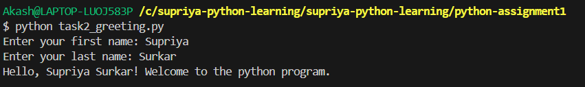

# Python Assignment – Module 2

## Task 1: Basic Mathematical Operations
This program takes two numbers from the user and performs:
- Addition
- Subtraction
- Multiplication
- Division

## Task 2: Personalized Greeting
This program takes the user's first and last name and prints a greeting message.

## How to Run
1. Open terminal
2. Run:

```python task1_math_operations.py```


```python task2_greeting.py```

